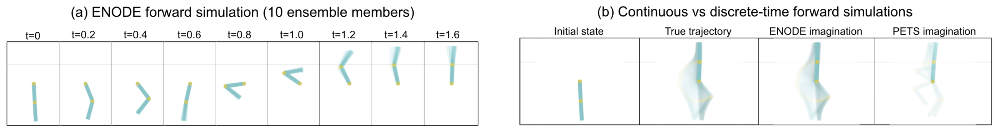

# ODE-RL
Experiment code for ICML 2021 paper [Continuous-time Model-based Reinforcement Learning](https://arxiv.org/pdf/2102.04764.pdf). Implemented in `Python 3.7.7` and `torch 1.6.0` (later versions should be OK). Also requires `torchdiffeq`, `TorchDiffEqPack` and `gym`.

## Quick introduction
- `runner.py` should run off-the-shelf. The file can be used to reproduce our results and it also demonstrates how to
  - create a continuous-time RL environment
  - initiate our model (with different variational formulations) as well as baselines (PETS & deep PILCO)
  - visualize the dynamics fits
  - execute the main learning loop (Algorithm-1 in the paper) 
- `ctrl` folder has our model implementation as well as helper functions for training.
  - `ctrl/ctrl`: creates our model and serves as an interface between the model and training/visualization functions.
  - `ctrl/dataset`: contains state-action-reward trajectories and interpolation (for continuous-time action) classes.
  - `ctrl/dynamics`: implements the dynamics model and is responsible for forward simulating all models.
  - `ctrl/policy`: deterministic policy implementation
- `envs` contains our continuous-time implementation of RL environments.
- `utils` includes the function approximators.
